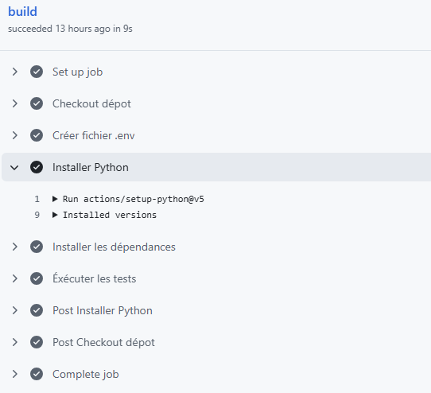
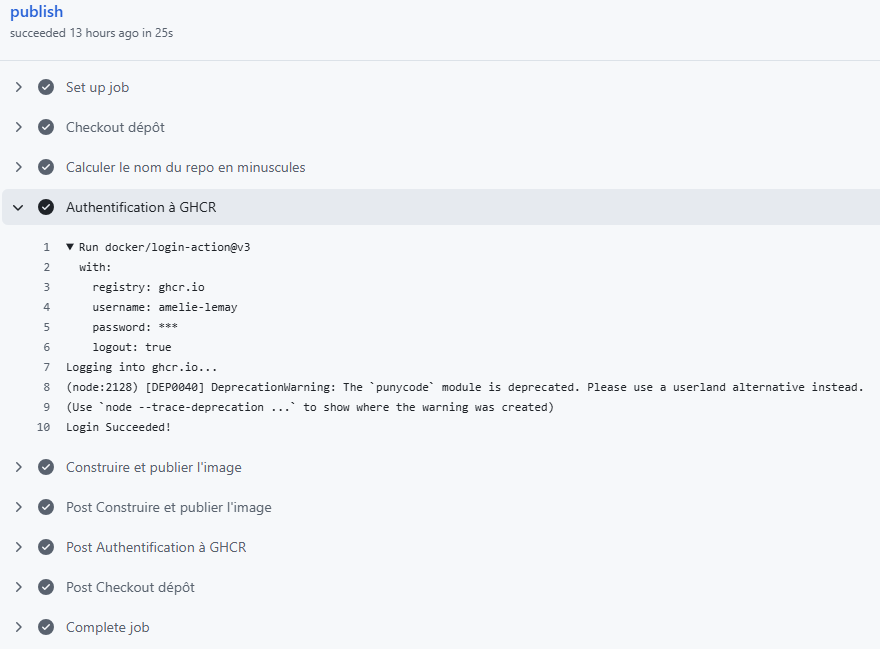

# Rapport du laboratoire 0

ÉTS - LOG430 - Architecture logicielle - Automne 2026

Étudiant(e) : Hugo Barou, Amélie Lemay, Martin Simon, Christine Yang-Dai

# Questions

## 1. Si l'un des tests échoue à cause d'un bug, comment pytest signale-t-il l'erreur et aide-t-il à la localiser ? Rédigez un test qui provoque volontairement une erreur, puis montrez la sortie du terminal obtenue.

Un message d'échec est affiché, avec une description de l'erreur au sein de la fonction fautive. De plus, un résumé est imprimé, spécifiant le test qui a échoué de même que le fichier de test.

Pour illustrer ceci, un nouveau test `test_add_failure` a été créé dans lequel une assertion fausse est vérifiée.


## 2. Que fait GitHub pendant les étapes de « setup » et « checkout » ? Veuillez inclure la sortie du terminal GitHub CI dans votre réponse.

Dans l'étape setup, GitHub prépare la machine virtuelle pour l'exécution du workflow.

Les journaux donnent des informations sur cette machine, notamment qu'il s'agisse d'une `Ubuntu 24.04.5 LTS`, avec une image `ubuntu-24.04`, située dans la région Azure `centralus`. Le runner, version `2.337.0`, exécute les commandes du workflow. Puis, GitHub configure les permissions du `GITHUB_TOKEN`, les secrets venant de `GitHub Actions Secrets` et l'autorisation à écrire dans le système de cache. Il prépare ensuite le répertoire du workflow et les actions nécessaires. Ici, il en trouve trois, qu'il télécharge. Finalement, il identifie le nom du job (`publish`) tel que déterminé dans .


Dans l'étape checkout, il clone le dépôt dans le runner pour l'exécution des prochaines étapes du workflow.

D'abord, l'actions `actions/checkout@v4` utilise le `GITHUB_TOKEN` pour s'authentifier et créer le dépôt dans `/home/runner/work/log430-labo0-A26/log430-labo0-A26` Il va ensuite configurer le dépôt (initialisation et authentification).


Il va alors récupérer (`fetch`) le dernier commit fait sur le main (`--depth=1`). Avec `checkout`, il place les fichiers du commit dans le workspace pour y exécuter les étapes suivantes.


## 3. Quel type d'informations pouvez-vous obtenir via les commandes `docker stats` et `top` ? Veuillez donner quelques exemples et expliquer la différence entre ce que chacune vous montre. Veuillez inclure la sortie du terminal dans votre réponse.

La commande `docker stats` donne une vue agrégée du conteneur telle que vue par le moteur Docker. La capture d'écran suivante montre le résultat lorsqu'elle est exécutée dans Docker Desktop. On voit, sur une période donnée, le résultat du lancement du conteneur sur l'utilisation du processeur et de la mémoire ainsi que la charge sur le disque et le réseau.


La capture d'écran suivante montre le résultat de la commande `top`. Celle-ci donne une vue par processus exécuté depuis l'intérieur du conteneur. Ici, 5 processus sont enregistrés mais seulement 3 sont actifs. La commande permet également de voir ce que chacun consomme dans un tableau. Par exemple, le processus identifié 1 (PID) est en état `sleeping` (colonne S) et a consommé 0.1 % de la mémoire de la machine.


# Déploiement

### Pipeline CI

Le  est déclenché à chaque `push` ou `pull_request`.

```yaml
on: [push, pull_request]
```

Il consiste en 5 étapes :

1. Récupérer le contenu du dépôt, comme à la question 2.

```yaml
steps:
  - name: Checkout dépot
    uses: actions/checkout@v4
```

2. Créer un fichier .env avec la variable nécessaire au lancement de l'application.

```yaml
- name: Créer fichier .env
  run: |
    echo "CALCULATOR_USERNAME=GithubActions" >> .env
```

3. Installer Python.

```yaml
- name: Installer Python
  uses: actions/setup-python@v5
  with:
    python-version: "3.11"
```

4. Installer les dépendances du projet avec pip.

```yaml
- name: Installer les dépendances
  run: |
    python -m pip install --upgrade pip
    pip install -r requirements.txt
    pip install pytest
```

5. Exécuter les tests du dépôt, dans `src/tests/test_calculator.py`.

```yaml
- name: Éxécuter les tests
  env:
    PYTHONPATH: ${{ github.workspace }}/src
  run: |
    python -m pytest
```

L'exécution de bout en bout de la pipeline est visible dans l'onglet GitHub Actions de notre dépôt. Chaque étape y est présente, avec les détails de leur exécution pour chacune (ici, seule celle de l'installation de Python est détaillée), mais des étapes "supplémentaires" s'ajoutent :

- `Set up job`, qui prépare l'environnement d'exécution comme détaillé à la question 2.
- `Post Installer Python` et `Post Checkout dépot`, qui réinitialise l'état du dépôt après l'exécution du pipeline.
- `Complete job`, qui clôt le build en nettoyant tous les processus orphelins.



### Pipeline CD

Le , lui, est déclenché uniquement lorsqu'un changement est poussé sur la branche `main`.

```yaml
on:
  push:
    branches: [main]
```

Il débute par une préparation de l'environnement, comme expliqué dans l'étape 2.

```yaml
jobs:
  publish:
    runs-on: ubuntu-latest
    permissions:
      contents: read
      packages: write
```

Puis, 4 étapes sont exécutées.

1. Récupération du dépôt (comme le CI).

```yaml
steps:
  - name: Checkout dépôt
    uses: actions/checkout@v4
```

2. Calcul du nom du dépôt en minuscules, en préparation à l'étape 4. Cette étape est nécessaire, car le registre prend seulement les chaînes de caractères en minuscules et le nom du dépôt est `log430-labo0-A26`.

```yaml
- name: Calculer le nom du repo en minuscules
  id: vars
  run: echo "repo-name=${GITHUB_REPOSITORY,,}" >> "$GITHUB_OUTPUT"
```

3. Authentification du workflow auprès de GHCR (GitHub Container Registry).

```yaml
- name: Authentification à GHCR
  uses: docker/login-action@v3
  with:
    registry: ghcr.io
    username: ${{ github.actor }}
    password: ${{ secrets.GITHUB_TOKEN }}
```

4. Construction et publication de l'image Docker avec le tag `latest`.

```yaml
- name: Construire et publier l'image
  uses: docker/build-push-action@v6
  with:
    context: .
    push: true
    tags: ghcr.io/${{ steps.vars.outputs.repo-name }}:latest
```

Nous pouvons également voir le résultat de l'exécution de la pipeline dans l'onglet GitHub Actions, avec toutes les étapes du fichier et les étapes de préparation et clôture. Comme pour l'éxecution du CI, au workflow `publish` du CD s'ajoute la préparation de l'environnement, les réinitialisations du dépôt et le nettoyage final.



### Apprentissages

Ce laboratoire nous a montré la différence entre CI et CD. Alors que le CI sert à valider automatiquement le code, le CD permet le déploiement automatique en construisant et publiant une image Docker du dépôt livré.

Également, nous avons appris que les pipelines sont hautement configurables et que nous déterminons l'ordre des étapes exécutées et ce que chacune fait. La gestion des dépendances, de l'authentification et de l'exécution sur une machine virtuelle sont toutes à prendre en compte. C'est surtout la création d'une variable pour le nom de notre dépôt en minuscule qui nous a fait réaliser que la configuration des pipelines est importante et de notre responsabilité.
